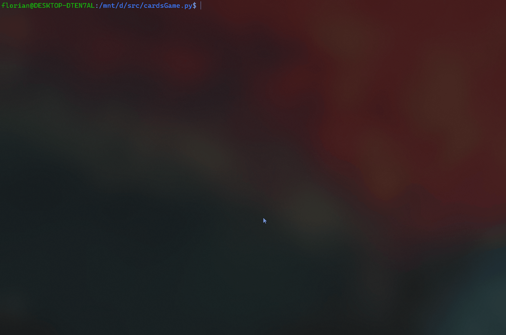

# **Cards Game**

Un jeu de carte classique sur terminal

## Aperçu



### Consignes

La liste des consignes du sujet est disponible dans le [TODO.md](TODO.md)

## Pré-requis

L'installation de **[Python 3](https://www.python.org/downloads/)** est recommandé pour l'éxécution du script

## Dépendances

- [json.load](https://docs.python.org/3/library/json.html#json.load)
- [json.dump](https://docs.python.org/3/library/json.html#json.dump)
- [os.system](https://docs.python.org/3/library/os.html#os.system)
- [platform.system](https://docs.python.org/3/library/platform.html#platform.system)
- [random.shuffle](https://docs.python.org/3/library/random.html#random.shuffle)
- [sys.argv](https://docs.python.org/3/library/sys.html#sys.argv)
- [time.sleep](https://docs.python.org/3/library/time.html#time.sleep)

## Utilisations

Exécution du script: `$ python main.py <arg>`

| Arguments                        | Valeur                               | Descriptions                                |
| -------------------------------- | ------------------------------------ | ------------------------------------------- |
| `-s <x>`, `--show-card <x>`      | `<x>` n° de carte                    | Affiche une carte du paquet                 |
| `-S`, `--show-all`               | -                                    | Affiche tout le paquet de cartes            |
| `-r <x>`, `--show-rand-card <x>` | `<x>` n° de carte                    | Affiche une carte du paquet mélangé         |
| `-R`, `--show-rand-all`          | -                                    | Affiche toutes les cartes du paquet mélangé |
| `-g`, `--game`                   | `<gameName>` nom du jeu              | Lance un jeu de carte                       |
| `-p`, `--players`                | `"['name', ...]"` liste de joueur(s) | Insérer un ou plusieurs joueur(s)           |
| `-h`, `--help`                   | -                                    | Affiche le menu d'aide                      |
| `-d`, `--debug`                  | -                                    | Exécution en mode debuger                   |
| `-v`, `--version`                | -                                    | Affiche la version du programme             |

## Options & Configurations

La configuration du programme se fait depuis le fichier **[config.json](config.json)** au format **json**, dans ce fichier vous pouvez **configurer la langue**, l'**encodage des caractères** ainsi que l'affichage du splash screen.

```json
{
  "encoding": "utf-8",
  "language": "fr",
  "splash": true
}
```

## Ressource disponibles

### Langues & Régions

Les langues disponibles sont contenus dans le répertoire **[core/regions/](core/regions/)**. Il contient les traductions du programme, vous pouvez en ajouter d'autre si vous le souhaitez, vous n'aurez alors qu'à spécifier son label (_exemple:_ `fr.json` _pour le français_) en nom de fichier sous format **json** avec tous son contenus.

Si le fichier de configuration contient un label de langue non-reconnu, alors **le programme adoptera la langue par défaut qui est l'anglais** avec **un encodage UTF-8**.

### Jeux implémentés

Les jeux implémentés sont contenus dans le module **[games.py](core/games.py)** sous la forme d'objet et sont déclarés à la fin du **[main.py](main.py)** sous la forme d'un **array**

```python
if __name__ == "__main__":
	games = [ ClosedBattle, Solitary, PeckerLady, Chickenshit, Liar ]
	# {...}
```

| Nom du jeu                                                                          | Jouable |
| ----------------------------------------------------------------------------------- | ------- |
| [La Bataille Fermée](<https://fr.wikipedia.org/wiki/Bataille_(jeu)>)                | Oui     |
| [Le Solitaire](<https://en.wikipedia.org/wiki/Klondike_(solitaire)>)                | Non     |
| [La Dame de Pique](<https://fr.wikipedia.org/wiki/Dame_de_pique_(jeu)>)             | Non     |
| [Le Pouilleux (Mistigri)](https://fr.wikipedia.org/wiki/Pouilleux)                  | Non     |
| [Le Menteur](https://ludos.brussels/ludo-walalou/opac_css/doc_num.php?explnum_id=5) | Non     |

### Gestion des joeurs

Le système de joueurs se fait directement en ligne de commande avec en arguments une liste de nom de joueur, de la manière suivante: `$ python main.py -p "['nomJoueur', ...]"`, vous pouvez en ajouter tant que vous voulez, la limitte du nombre de joueurs dépendra du mode de jeu choisit.

Si vous entrer une liste contenant 4 joueurs alors que vous avez sélectionner un mode de jeu nécessitant seulement 2 joueurs, alors le jeu ne prendra que les 2 premiers de la liste. Et si il manque un ou plusieurs joueurs requis, alors le mode de jeu ne se lancera pas tout simplement.

Les noms des joueurs sont sauvegarder directement dans le fichier **[players.json](core/players.json)** qui est dans le répertoire **[core/](core/)**.

## Licence

Code sous license [GPL v3](LICENSE)
